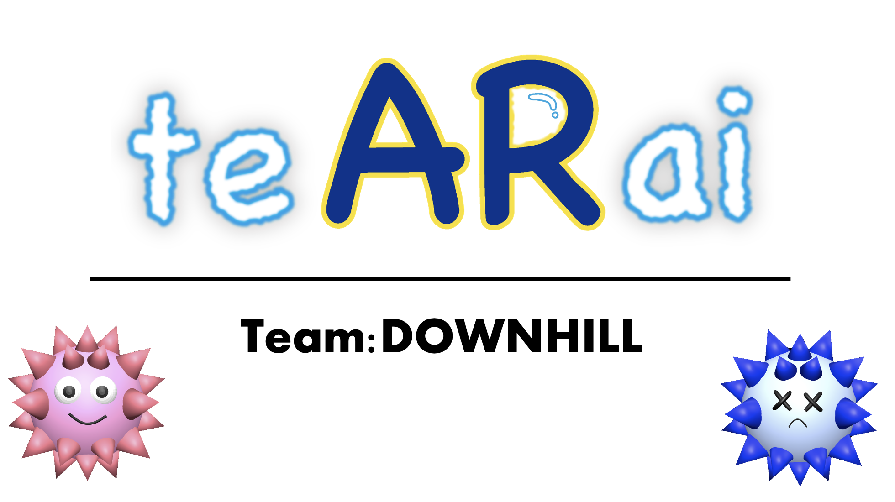

# te AR ai

## 製品概要
### 背景(製品開発のきっかけ、課題等）
コロナ禍で手洗いの重要性が再認識されています。  
体調管理の基本として、大人はもちろんのことですが、子供達にもきちんと手洗いをしてもらいたいものです。しかし、子供達は何度教えても手洗いが雑になりがちです。  
そこで、子供達にも手洗いの重要性を認識してもらい、正しい方法で、楽しく手洗いをしてもらうためにこのwebアプリケーションを作成しました。

---

### 製品説明（具体的な製品の説明）
カメラに手を映すと、ウイルスとHPバーが表示されます。手洗いの進行に合わせてウイルスが徐々に弱っていき、十分な時間手を洗い続けると、ウイルスが倒されて手洗い完了となります。   
ウイルスの3DモデルをARで表示させることにより、何のために手を洗うのかが明確になり、手洗いの重要性を子供にも分かりやすく伝えることができます。そして、ウイルスが弱っていく視覚的なフィードバックによって、ゲーム感覚で正しい手洗いの時間感覚を身につけてもらえます。

---

### 特長
1. 子供に利用してもらうことを想定したデザインとUI
2. 手洗いの動作と連動した視覚フィードバック
3. タイマーやスコア等の単なる数字ではなく、視覚情報によって正しい手洗いを促す点

---

### 解決出来ること
子供に対する、十分な時間をかけて手を洗う指導の手助け。

---

### 今後の展望
* 対応デバイスの拡大、多様化。
* 音声コントロールへの対応。
* 手洗い時の演出の強化

---

### 注力したこと（こだわり等）
* 子供向けに親しみやすいデザイン
* 手洗いの進行に合わせてHPバーやウイルスのモデルを変化させ、「ウイルスと戦っている」感覚を得られるようにしたこと

---

## アクセス先
URL:https://wash.downhillapp.com

---

## 開発技術
### 活用した技術
#### API・データ
* MediaPipe

#### フレームワーク・ライブラリ・モジュール
* Three.js
* swiper.js

#### デバイス
#### スマートフォンのブラウザ
* Safari (バージョン16.0以降 推奨)  
* Chrome (バージョン105以降 推奨)

### 独自技術
#### ハッカソンで開発した独自機能・技術
* MediaPipeとThree.jsを用いた、手の認識に伴うモデルの表示、変更  
該当箇所：[camera.js](./camera.js), [wash.html](./wash.html), [script.js](./script.js)
